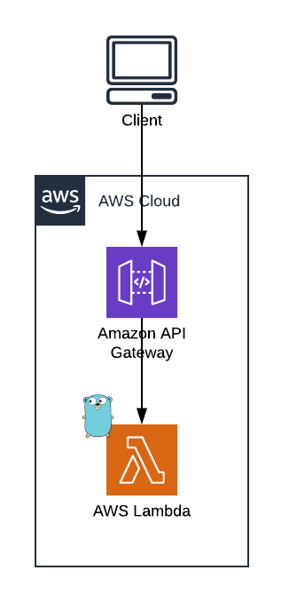

# Australia Post 4-state barcode
This is a minimalistic library written in golang that generates the 4-state barcode used by Australia Post


## Live Demo

Click [here](http://4-state-barcode.com.au.s3-website-ap-southeast-2.amazonaws.com/) to try the 4-state barcode generation online

## Why
The main reason I've written this library is because couldn't find anything that would satisfy the following criterias:
* a small binary that can be run from a lambda function.
* simple to understand code with the minimum functionality and configuration options
* generates barcode as SVG file

4-state-barcode library does only one thing &mdash; generates a 4 state barcode as SVG file.
 
Additionally, it allows to pass an optional text and change a few configuration options.
The guidelines how to generate 4 state barcode required by Australia Post are taken from [customer-barcode-technical-specifications-aug2012.pdf](https://auspost.com.au/.../customer-barcode-technical-specifications-aug2012.pdf) file.

## Usage
The library can used in 3 different ways.
### As code
```bash
$ go get -u github.com/b-b3rn4rd/australia-post-barcode
```
```go
package main

import (
    "os"
    "github.com/b-b3rn4rd/4-state-barcode/src/australiapost"
)

func main()  {
    file, _ := os.Create("barcode.svg")
    generator := australiapost.NewFourStateBarcode("5956439111ABA 9", file, "hello world")
        
    err := generator.Generate()
    if err != nil {
        panic(err)
    } 
}
```

There are several optional configuration functions available:
* `OptionPadding(padding int) Option`
* `OptionLogger(logger Logger) Option`
* `OptionRatio(ratio int) Option`
* `OptionFontSize(fontSize int) Option`
* `OptionBackgroundColor(color string) Option`
* `OptionFontColor(color string) Option`
* `OptionalEncoder(encoder Encoder) Option`
* `OptionBarWidth(width int) Option`

The following example generates barcode's content into a variable

```go
package main

import (
    "os"
    "bytes"
    "fmt"
    "github.com/b-b3rn4rd/4-state-barcode/src/australiapost"
)

func main()  {
    b := bytes.Buffer{}
    
    generator := australiapost.NewFourStateBarcode("5956439111ABA 9", &b, "hello world", 
    	australiapost.OptionPadding(10),
        australiapost.OptionBackgroundColor("blue"),
        australiapost.OptionFontSize(12),
    )
        
    err := generator.Generate()
    if err != nil {
        panic(err)
    }
    
    s := b.String()
    
    fmt.Println(s)
}
```

### As CLI
Download the latest release and run a suitable executable file

```bash
$ 4-state-barcode --help
Australia Post 4 state barcode generator
Generates a SVG image containing barcode with an optional additional text
Example: 
4-state-barcode -b "5956439111ABA 9" -f barcode.svg

Usage:
  4-state-barcode [flags]

Flags:
  -b, --barcode string    Barcode value
  -f, --filename string   Output filename
  -h, --help              help for 4-state-barcode
  -t, --text string       Optional barcode text
      --version           version for 4-state-barcode

```

### Using Docker Image

```bash
$ docker run \
    -v /tmp/barcode:/tmp/barcode \
    -it \
    --rm bernard/4-state-barcode:latest \
    --barcode "6256439111HELLO" \
    --filename /tmp/barcode/barcode.svg

$ cat /tmp/barcode/barcode.svg
  <?xml version="1.0"?>
  <!-- Generated by SVGo -->
  .....
```

## Barcode generation using HTTP server
The `lambda` directory contains AWS CloudFormation and Lambda function's handler to generate
4-state barcodes using HTTP protocol.



### AWS Provisioning
In order to deploy the required infrastructure ensure that you have the correct credentials assumed and run the provided `Makefile`.

```bash
$ S3_BUCKET_NAME=<EXISTING_S3_BUCKET_NAME> make deploy
```
### API calls example
The following HTTP request will generate barcode with barcode value of `5956439111ABA 9` and optional text `Hello World` 
and save it as svg file. Notice that by default API endpoint base64 encodes barcode content, hence we are using `base64 --decode` 
before saving the response.

```bash
$ curl -s "https://<API_ENDPOINT_ID>.execute-api.<AWS_REGION>.amazonaws.com/prod?barcode=5956439111ABA%209&text=Hello%20World" | base64 --decode > barcode.svg
```